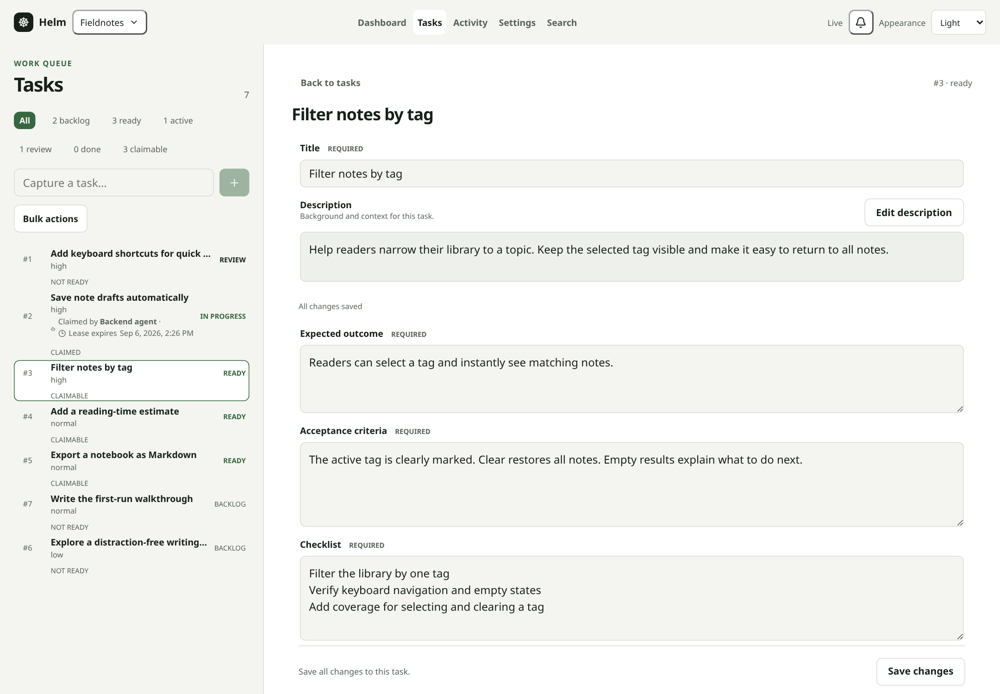
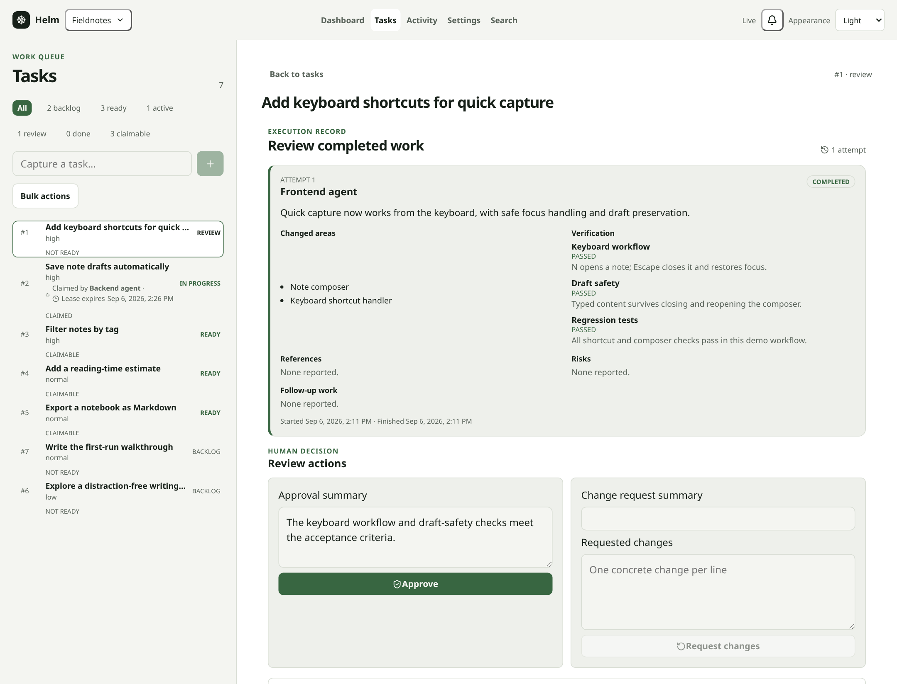
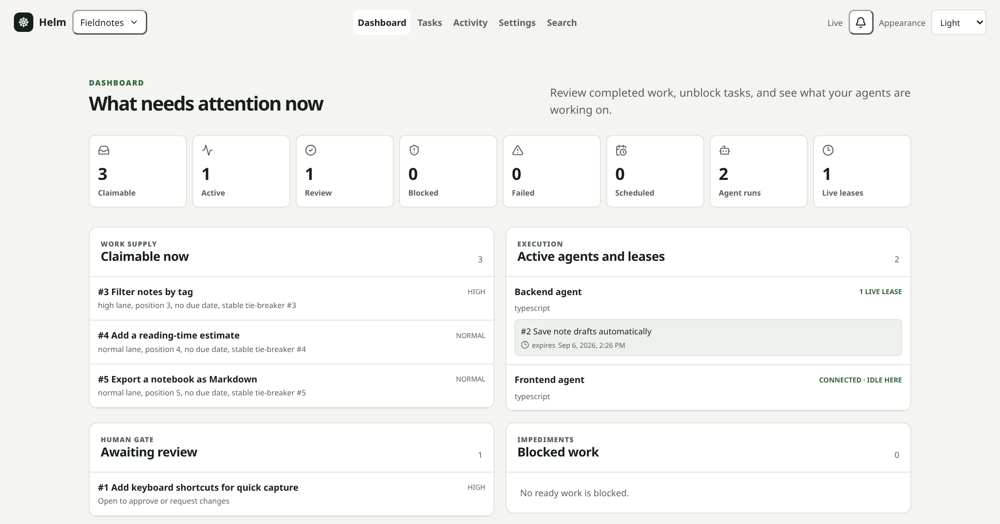

# Helm

A local project manager for you and your coding agents.

You decide what needs doing, give it enough context, and review the result. Your agents pick up
ready tasks, report progress, and hand back their work—all in the same queue.



Prepare clear tasks and see who is working on what.

## Why use it?

Working with several agents means keeping instructions, priorities, and results in sync. Helm gives
that coordination a home outside your chat history:

- **Prepare work once.** Keep the expected outcome, acceptance criteria, checklist, and agent context
  together.
- **Avoid duplicate work.** Agents claim tasks exclusively; abandoned claims expire so work can be
  picked up again.
- **Stay in control.** Follow live progress, resolve blockers, review evidence, and request another
  attempt without losing the earlier history.

Humans use the browser. Agents connect through MCP, a protocol that lets an agent use Helm's tools.
Both see the same tasks, backed by a local SQLite database. No account or cloud service is required.

Helm coordinates work; it **does not launch agents or write code for you**. You run your coding agents
separately and connect them to Helm.

## Start locally

You need Git, Node.js **22.13+**, pnpm **11**, and a local Git repository to manage.

```sh
git clone https://github.com/juanfran/helm.git
cd helm
pnpm install --frozen-lockfile
pnpm dev
```

Open [Helm](http://127.0.0.1:3000) and create a project using the absolute path to your repository.
Helm creates its database automatically; your repository files stay where they are.

For everyday use without the development server, run `pnpm build` followed by `pnpm start`.

## Your first human–agent workflow

1. Capture an idea as a task. It starts in the backlog, not in an agent's queue.
2. Add an expected outcome, acceptance criteria, and at least one checklist item; move it to **Ready**.
3. Connect your agent's MCP client to `http://127.0.0.1:3000/api/mcp` using **Streamable HTTP**.
4. Ask the agent to register with Helm, discover ready work, claim one task, and report its progress.
5. Review its completion report in Helm. Approve it, request changes, or reopen it later.

**[Follow the getting-started tutorial →](docs/getting-started.md)**

The tutorial walks through MCP connection settings, a complete first task, example agent prompts,
parallel agents, dependencies, and recovering blocked work.



Agents hand back evidence, not just “done.” You make the review decision.

<details>
<summary>See the dashboard: ready work, active agents, and reviews</summary>



See what can start next, which agent holds each claim, and what needs your attention.

</details>

## Learn more

- [Configuration, backups, updates, and troubleshooting](docs/operations.md)
- [Product behavior and supported scope](docs/product.md)
- [Architecture and technical constraints](docs/architecture.md)
- [Contributing and verification commands](CONTRIBUTING.md)

Helm currently targets one person and multiple agents on one machine, with one repository per project.
It has no authentication, remote collaboration, or external-tracker synchronization. Keep it bound to
localhost; do not expose it to the internet.
